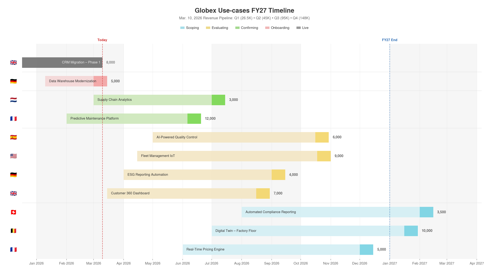
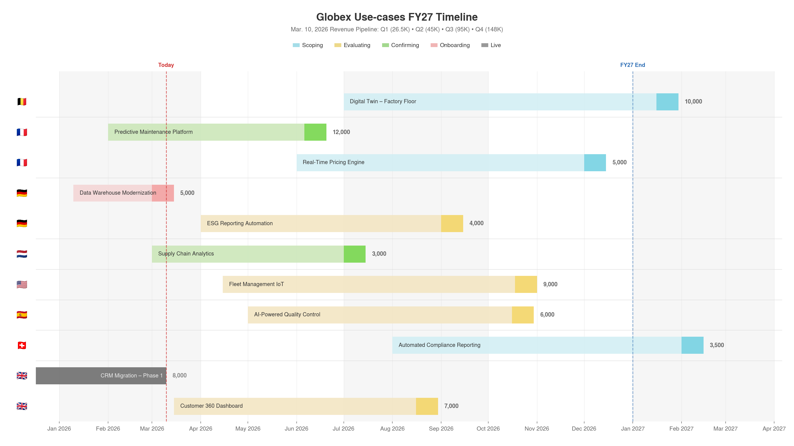
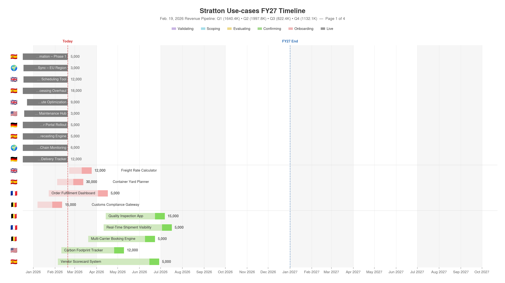
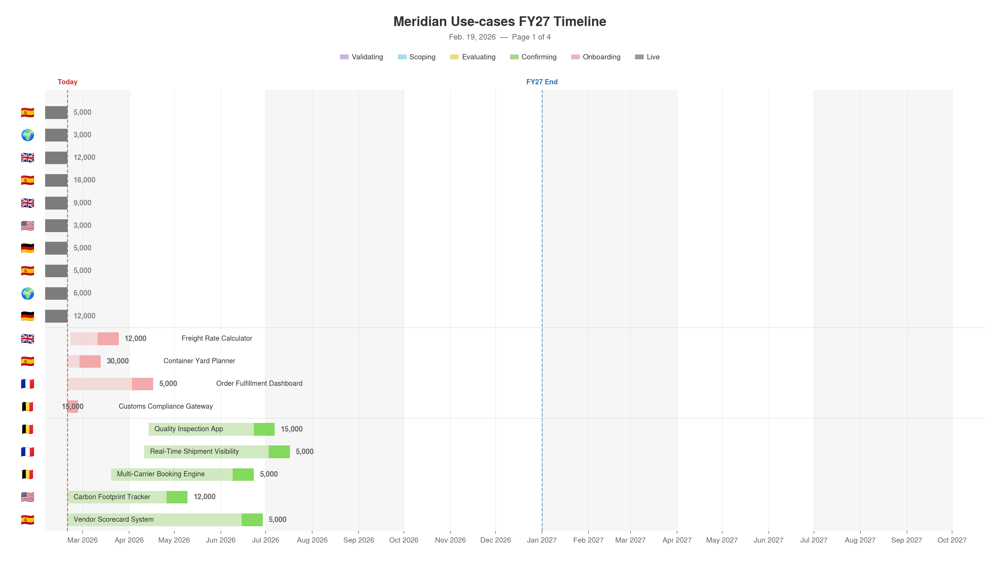

# pipeline-gantt

A [Claude AI skill](https://docs.anthropic.com/en/docs/agents-and-tools/agent-skills) that generates polished **16:9 Gantt timeline charts** from pipeline CSVs. Transparent background — drops cleanly onto any slide colour.

| By Stage | By Business Unit |
|----------|-----------------|
|  |  |

## Features

- **Six pipeline stages**: Validating → Scoping → Evaluating → Confirming → Onboarding → Live
- **Two-tone bars**: pastel ramp-up + saturated 14-day segment at the target date
- **Live bars**: light grey → dark 14-day tip at go-live → medium grey to today
- **Configurable fiscal quarters**: alternating shading based on `--fy-start`
- **FY-end marker**: blue dashed line at the fiscal year boundary
- **Country flag emojis** on the Y axis (30+ built-in, extensible via `--flags`, or `--no-flags`)
- **Auto-detection** of account name, date, column names, and value metric from the CSV
- **Sort by stage** (pipeline stage) or **by BU** (Business Unit / country)
- **Quarterly pipeline totals** in the subtitle, with configurable metric label
- **Auto-pagination** for large datasets (~20 rows/page, group-aware splitting)
- **Multi-page PDF** with `--pdf`
- **Stage filtering**: `--exclude-stages` / `--include-stages`
- **Transparent PNG** at 16:9 (2880×1620 @ 150 DPI)
- **Smart column matching** — recognises Revenue, ARR, MRR, Value, and more

### Multi-page output

Large datasets automatically split across numbered PNGs. Every page shares the same header, legend, x-axis range, "Today" line, and FY-end marker — ready to drop onto consecutive slides.

**Stratton** (50 rows, with quarterly pipeline totals):



**Meridian** (50 rows, minimal columns — subtitle shows date only):



## Installation

### Claude.ai (web)

Download the `.skill` file from [Releases](../../releases) and upload it in **Settings → Features → Skills**.

### Claude Code

```bash
# Personal (all projects)
claude mcp add-skill pipeline-gantt ./scripts/generate_gantt.py

# Project-specific
claude mcp add-skill pipeline-gantt ./scripts/generate_gantt.py --project
```

### API / custom

Include `SKILL.md` in your system prompt and make `scripts/generate_gantt.py` available in your tool sandbox.

## Quick start

```bash
python scripts/generate_gantt.py data.csv output.png
```

Everything is auto-detected from the CSV. Override anything:

```bash
python scripts/generate_gantt.py data.csv output.png \
  --account "Acme" \
  --sort bu \
  --fy-start 2 \
  --metric-label "ARR" \
  --exclude-stages Validating \
  --max-rows 15 \
  --pdf
```

## CSV format

The script needs a CSV with at minimum a **name**, **stage**, **start date**, and **end date** column. It auto-detects column names — these are all recognised (case-insensitive):

| Purpose | Recognised names |
|---------|-----------------|
| **Name** | Name, Use Case, Project, Deal, Opportunity |
| **Region / BU** | Business Unit, BU, Region, Country, Territory, Segment |
| **Stage** | Plain Status, Status, Stage, Stage (plain), Pipeline Stage, Phase |
| **Start date** | Onboarding date, Start date, Start Date, Begin Date |
| **End date** | Target live date, Live date, Go-live date, End Date, Target Date |
| **Value** | Monthly Revenue, Revenue, ARR, MRR, Value, Amount |

Optionally, include **monthly columns** in `YYYY-MM` format (e.g. `2026-01`, `2026-02`, …) for quarterly pipeline totals in the subtitle. If these columns are absent, the subtitle simply shows the date.

If your column names don't match any candidate, use `--col-*` flags to specify them explicitly.

Three example CSVs are included:

| File | Rows | Columns | Monthly data | Notes |
|------|------|---------|:---:|-------|
| [`Globex_Pipeline_v1_2026-03-10.csv`](examples/Globex_Pipeline_v1_2026-03-10.csv) | 11 | all | ✓ | Small account, single page |
| [`Meridian_Pipeline_v2_2026-02-19.csv`](examples/Meridian_Pipeline_v2_2026-02-19.csv) | 50 | 6 | ✗ | Large account, bare minimum columns |
| [`Stratton_Pipeline_v1_2026-02-19.csv`](examples/Stratton_Pipeline_v1_2026-02-19.csv) | 50 | 24 | ✓ | Large account, fully detailed with quarterly pipeline totals |

## CLI reference

### Chart options

| Flag | Default | Description |
|------|---------|-------------|
| `--account` | *auto* | Account name (extracted from filename) |
| `--title` | *auto* | Full chart title |
| `--today` | *auto* | "Today" reference date as YYYY-MM-DD |
| `--sort` | `stage` | Group by: `stage` or `bu` |
| `--dpi` | `150` | Output resolution |
| `--no-flags` | off | Hide flag emojis on the Y axis |
| `--y-label` | hidden | Custom Y axis label |
| `--flags` | — | JSON `{"Region":"🏳️"}` to add/override flag mappings |

### Stage filtering

| Flag | Default | Description |
|------|---------|-------------|
| `--include-stages` | all | Only show these stages (space-separated) |
| `--exclude-stages` | none | Hide these stages (space-separated) |

### Pagination

| Flag | Default | Description |
|------|---------|-------------|
| `--max-rows` | `20` | Max rows per page. Set to `0` to disable |
| `--pdf` | off | Also generate a single multi-page PDF |

When a dataset exceeds `--max-rows`, output is automatically split into numbered PNGs (`output_1.png`, `output_2.png`…). Groups (stage or BU) are kept together when they fit; oversized groups split at the row limit.

### Fiscal year

| Flag | Default | Description |
|------|---------|-------------|
| `--fy` | *auto* | Fiscal year label, e.g. FY27 |
| `--fy-start` | `1` | Month the fiscal year starts |

Common configurations:

| `--fy-start` | Convention | Used by |
|---|---|---|
| `1` | Jan → Dec | Calendar year (default) |
| `2` | Feb → Jan | Feb-start organisations |
| `4` | Apr → Mar | UK government, many APAC companies |
| `7` | Jul → Jun | Australia, some US states |
| `10` | Oct → Sep | US federal government |

### Metric / value

| Flag | Default | Description |
|------|---------|-------------|
| `--value-col` | *auto* | Column name for the numeric value |
| `--metric-label` | `Revenue` | Label shown in the subtitle (e.g. Revenue, ARR, MRR, DBU) |

### Column mapping (overrides auto-detection)

| Flag | Description |
|------|-------------|
| `--col-name` | Use-case name column |
| `--col-bu` | Business Unit column |
| `--col-status` | Pipeline stage column |
| `--col-onboard` | Start date column |
| `--col-live` | End date column |

## Built-in flag mappings

Country and region names on the Y axis are rendered as emoji flags. 30+ mappings are built in:

🇧🇪 Belgium · 🇬🇧 United Kingdom · 🇫🇷 France · 🇩🇪 Germany · 🇳🇱 Netherlands · 🇪🇸 Spain · 🇮🇹 Italy · 🇮🇪 Ireland · 🇨🇭 Switzerland · 🇸🇪 Sweden · 🇳🇴 Norway · 🇩🇰 Denmark · 🇫🇮 Finland · 🇵🇱 Poland · 🇵🇹 Portugal · 🇦🇹 Austria · 🇨🇿 Czech Republic · 🇬🇷 Greece · 🇺🇸 North America · 🇨🇦 Canada · 🇲🇽 Mexico · 🇧🇷 Brazil · 🇦🇺 Australia · 🇯🇵 Japan · 🇨🇳 China · 🇮🇳 India · 🇰🇷 South Korea · 🇸🇬 Singapore · 🇦🇪 Middle East · 🌍 EMEA · 🌏 APAC · 🌎 LATAM · 🌐 Global · 🏢 Corporate

Unknown BUs show ❓. Add or override with `--flags '{"Turkey":"🇹🇷"}'`. Hide all flags with `--no-flags`.

## Visual design

| Element | Detail |
|---------|--------|
| **Background** | Fully transparent — works on any slide colour |
| **Font** | TeX Gyre Heros (Helvetica clone, sans-serif fallback) |
| **Non-live bars** | Pastel body → saturated 14-day tip at target date |
| **Live bars** | Light grey → dark 14-day tip at go-live → medium grey to today |
| **Validating** | Lavender/purple — visually distinct from all other stages |
| **Quarter shading** | Alternating subtle grey bands |
| **"Today"** | Red dashed line with label |
| **"FY End"** | Blue dashed line at fiscal year boundary |
| **Names** | Auto-truncated to fit inside bar boundaries; overflow shown outside |
| **Legend** | Only stages present in the data are shown |

## Dependencies

- Python 3.10+
- pandas, numpy, matplotlib, Pillow
- TeX Gyre Heros font (optional; falls back to system sans-serif)
- Noto Color Emoji font (for flag rendering)

## License

[MIT](LICENSE)
